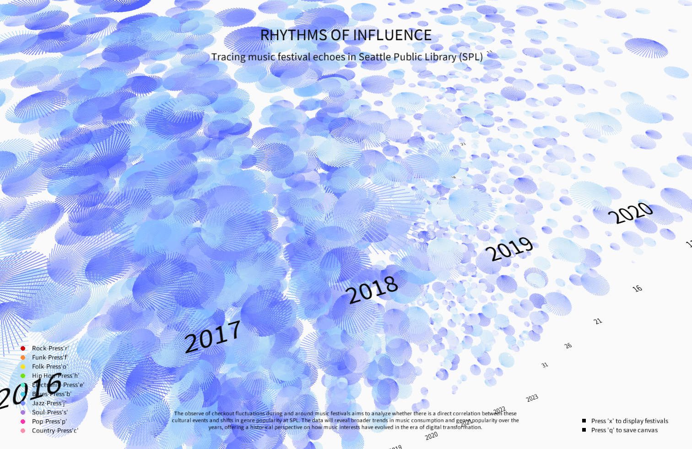

# Rhythms of Influence

An interactive 3D visualization of music-related circulation at the Seattle Public Library, built with Processing (Java) and MySQL.

The project explores music-related borrowing at the Seattle Public Library across ten genres during 2015–2023. A separate festival view provides cultural context for an exploratory question: how might local music events relate to the timing of library circulation?



## Features

- **Three spatial axes:** year, month, and day.
- **Animated visual encoding:** firework-inspired radial forms vary in size, opacity, and rotation speed with genre-related circulation activity.
- **Ten genres:** hip hop, rock, jazz, electronic, pop, country, folk, soul, blues, and funk.
- **Exploration:** camera navigation, date filters, genre switching, light/dark mode, and a separate festival view.

## Requirements

- Processing 4 with the Java mode and P3D renderer.
- ControlP5 2.2.6.
- PeasyCam 302.

Third-party libraries are installed separately. The bundled CSV files are sufficient to run the visualization; a live MySQL connection is not required.

## Getting started

1. Install [Processing 4](https://processing.org/download/).
2. Install **ControlP5** and **PeasyCam** in Processing’s sketchbook `libraries` directory. See the [ControlP5 documentation](https://www.sojamo.de/libraries/controlP5/) and [PeasyCam documentation](https://mrfeinberg.com/peasycam/).
3. Download or clone this repository, then open `RhythmsofInfluence/RhythmsofInfluence.pde` in Processing. Keep all seven `.pde` tabs and the `data` folder together.
4. Click Run. The sketch opens full-screen and loads the daily circulation data.

## Controls

| Action | Control |
| --- | --- |
| Rotate the scene | Left mouse drag |
| Zoom | Mouse wheel or right mouse drag |
| Pan | Middle mouse drag; Command + left drag on macOS |
| Reset camera | Double-click |
| Filter by date | Year, Month, and Day fields; use numeric input and clear a field to remove that filter |
| Switch circulation/festival view | `x` |
| Save a frame | `q` |
| Light/dark background | Toggle Mode button |

| Genre | Key | Genre | Key |
| --- | --- | --- | --- |
| Hip hop | `h` | Country | `c` |
| Rock | `r` | Folk | `o` |
| Jazz | `j` | Soul | `s` |
| Electronic | `e` | Blues | `b` |
| Pop | `p` | Funk | `f` |

## Data and SQL

The MySQL queries join circulation records to subject metadata, select music-classified CDs, DVDs, and books, and count keyword matches for ten genres. Daily aggregates drive the visualization; monthly and yearly aggregates support broader comparisons.

- `RhythmsofInfluence/data/CheckOutNum_Date.csv`: daily aggregates used by the sketch.
- `data/aggregates/`: monthly and yearly aggregates.
- `sql/`: daily, monthly, yearly, and July 2021 CD-title queries.
- [Data methods and limitations](docs/data.md).

## Repository structure

```text
RhythmsofInfluence/      Processing sketch and runtime data
  data/                 Daily circulation CSV
data/aggregates/         Monthly and yearly CSV files
sql/                    MySQL extraction queries
docs/                   Data methods and verification notes
  images/               Visualization preview
```

## Known limitations

- Counts represent matches in joined subject records, **not deduplicated checkout totals**. Genres can overlap, and missing dates should not be interpreted as zero borrowing.
- Visual scales differ by genre, so equal-sized marks across genres do not necessarily represent equal counts.
- Festival annotations are hardcoded and require date verification; one entry falls outside the 2015–2023 circulation period. The visualization supports exploration rather than causal conclusions.
- Date fields require numeric input. Nonnumeric text can cause an exception, and keyboard shortcuts remain active while editing fields.

See [verification notes](docs/verification.md) for validation details and runtime status.
